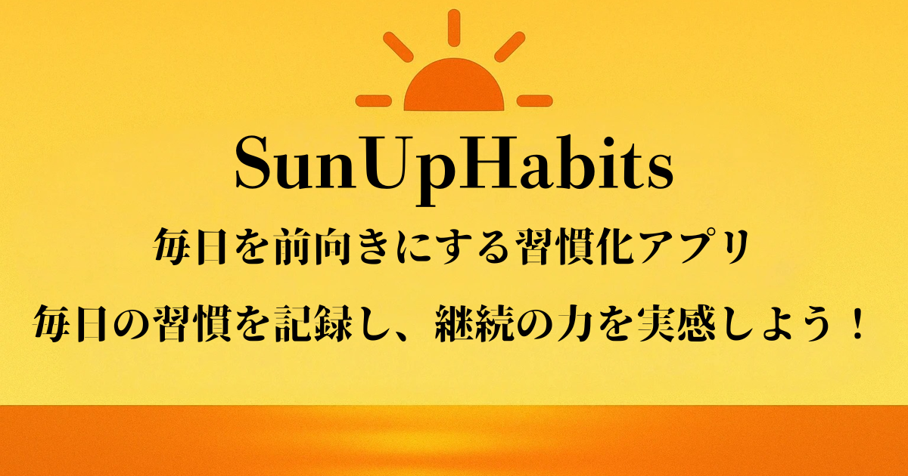

# SunUpHabits

## 目次
- [サービス概要](#サービス概要)
- [サービスURL](#サービスurl)
- [このサービスへの思い・作りたい理由](#このサービスへの思い・作りたい理由)
- [ユーザー層について](#ユーザー層について)
- [サービスの利用イメージ](#サービスの利用イメージ)
- [サービスの差別化ポイント・推しポイント](#サービスの差別化ポイント・推しポイント)
- [機能一覧](#機能一覧)
- [使用技術](#使用技術)
- [画面遷移図](#画面遷移図)
- [ER図](#er図)

## サービス概要
「SunUpHabits」は、**朝のルーティンに特化**した習慣化支援のWebアプリです。達成した内容を短い操作で投稿し、タイムラインで他のユーザーの取り組みを確認できます。**いいね／コメント**で気軽に励まし合えるため、習慣を続けやすくなります。投稿は**24時間いつでも**可能です（朝に使いやすいUIを意識しています）。

## サービスURL
https://sunuphabits.com/

## このサービスへの思い・作りたい理由
忙しい朝は時間に余裕がなく、私自身、習慣を続けることに何度も失敗しました。そこで、達成を**すぐ記録でき**、他の人の取り組みが**ひと目でわかり**、気軽に**声をかけ合える**場をつくりました。
SunUpHabitsは、朝に取り組む習慣を**短い操作で記録し、互いに励まし合える**ことを大切にしています。

## ユーザー層について
主な対象は**20〜40代の社会人**です。

- **20〜30代前半**：成長意欲が高く、限られた時間で生産性を上げたい層。
- **30代後半〜40代**：家庭・仕事の負荷が高く、健康維持やストレス軽減を重視する層。

共通ニーズ：
- 朝の短い時間でも**無理なく続けられる**こと
- 記録が**見える**こと（達成感が得られる）
- **人の目や声かけ**があること（孤独にならない）

## サービスの利用イメージ
**短い操作で投稿、達成を可視化。**

1. アカウント登録（メール／Google）。初回にルーティンを2〜3個設定。
2. 達成したら内容を投稿（例：瞑想3分・白湯・日記1行など）。
3. タイムラインで**他ユーザーの達成**が流れ、**いいね／コメント**で相互に後押し。
4. マイページで**達成率や履歴**を振り返り、次の行動につなげます。

## サービスの差別化ポイント・推しポイント
- **朝の行動に合わせた設計**：入力項目を最小限にし、数タップで投稿が完了。忙しい時間帯でも手間取らないUI。
- **コミュニティによる継続支援**：タイムラインで仲間の取り組みが見え、**いいね／コメント**で気軽に励まし合える。
- **機能を必要最小限に**：コミュニケーションはいいねとコメントに絞り、朝の負担を増やさない。
- **記録の見える化**：連続日数や達成率を示し、「今日は続けよう」という気持ちを後押し。
- **他サービスとの違い**：汎用のタスク管理ではなく、**朝の習慣に特化**し、続けやすさに直結する機能だけを提供。

## 機能一覧
- ユーザー登録 / ログイン・ログアウト（Devise）
- Googleログイン（OmniAuth Google）
- パスワードリセット
- マイページ
- プロフィール編集 / アカウント削除
- マイ習慣の一覧 / 登録 / 投稿 / 編集 / 削除
- 達成率の可視化
- 投稿一覧 / 詳細
- コメント
- いいね
- 投稿検索
- 利用規約
- お問い合わせ
- プライバシーポリシー

## 使用技術

| カテゴリ | 技術 |
| :--- | :--- |
| バックエンド | Ruby on Rails 7.2.1, Ruby 3.3.0 |
| フロントエンド | Ruby on Rails 7.2.1, Hotwire（Turbo / Stimulus） |
| CSSフレームワーク | TailwindCSS, DaisyUI |
| データベース | PostgreSQL |
| ファイルサーバー | AWS S3 |
| 認証 | Devise, OmniAuth (Google OAuth2) |
| 検索 | Ransack |
| 環境構築 | Docker |
| CI | GitHub Actions（Brakeman, RuboCop, RSpec） |
| インフラ | Render |
| バージョン管理ツール | GitHub |

## 画面遷移図
https://www.figma.com/design/izVMYDOrBbco6wC9yqtoxc/%E7%84%A1%E9%A1%8C?node-id=0-1&m=dev&t=rusuccY7ZeOl5VgO-1

## ER図
https://drive.google.com/file/d/1xAAetXq2nLOnhoxRIti_OjzThKr0i113/view?usp=sharing